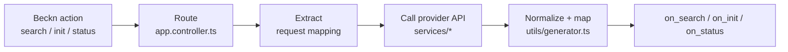
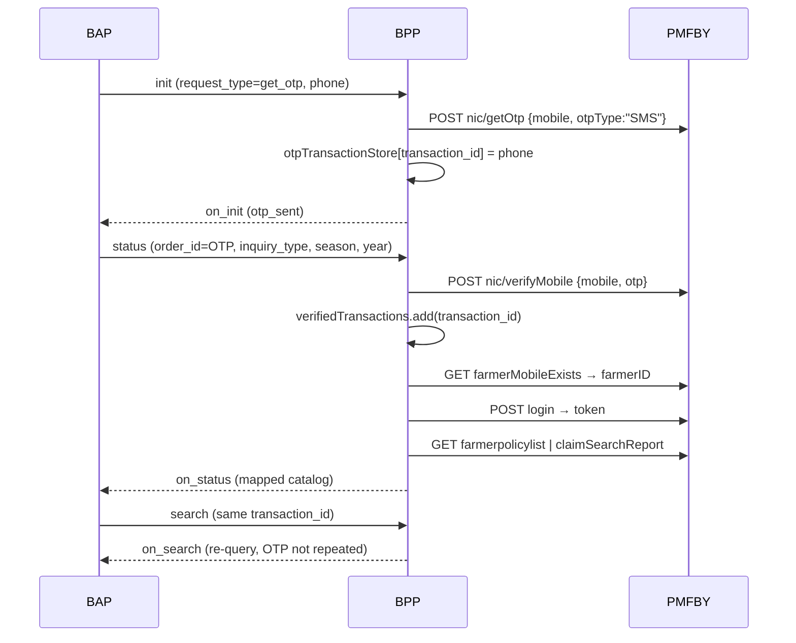

# Bharat Vistaar — Provider Catalogue

Reference for every external system this BPP integrates with: who the provider is, which
API is called, the exact payload sent, the response received, and how the Beckn request is
mapped onto it and back.

· Domain: `schemes:vistaar`
· Protocol: Beckn v1.1.0
· Service: `beckn-onix-network-provider` (NestJS)
· Scope: 8 providers / 8 use cases

## Sources and verification status

Two sources, and they do **not** fully agree — read this before trusting a payload below.

| Source | What it gives | Reflects |
|---|---|---|
| Repo source, branch `BharatVistaar` | All mapping logic, tag codes, validation | this branch |
| `Network API Details.docx` (traces dated 2026-08-18) | Real on-wire request/response pairs, real hostnames | `main` |

**`BharatVistaar` is 0 ahead / 138 behind `origin/main`.** Its newest Mandi commit is
2026-04-09; `main` has three later Mandi reworks (2026-05-05, 05-22, 06-24) and splits the
service into five files. Where the two disagree the divergence is called out inline and
in [§7](#7-known-gaps) — the captured traces are the better guide to **production**, this
document's mapping tables to **this branch**.

Payloads marked *(trace)* are captured from a live call. Everything else is read from
source and has not been executed.

---

## Contents

1. [Architecture](#1-architecture)
2. [Provider index](#2-provider-index)
3. [Routing table](#3-routing-table)
4. [Provider details](#4-provider-details)
   - [4.1 Agmarknet Vistaar — Mandi price discovery](#41-agmarknet-vistaar--mandi-price-discovery)
   - [4.2 IMD — Weather forecast](#42-imd--weather-forecast)
   - [4.3 Mausamgram — Gram-panchayat weather](#43-mausamgram--gram-panchayat-weather)
   - [4.4 PM-Kisan — Beneficiary status](#44-pm-kisan--beneficiary-status)
   - [4.5 PMFBY — Crop insurance](#45-pmfby--crop-insurance)
   - [4.6 Soil Health Card](#46-soil-health-card)
   - [4.7 OAN vector index — Knowledge advisory](#47-oan-vector-index--knowledge-advisory)
   - [4.8 Hasura — Scheme content store](#48-hasura--scheme-content-store)
5. [Cross-cutting mapping conventions](#5-cross-cutting-mapping-conventions)
6. [Configuration reference](#6-configuration-reference)
7. [Known gaps](#7-known-gaps)
8. [Sibling networks](#8-sibling-networks)

---

## 1. Architecture

This service is a Beckn **BPP** (provider-side adapter). Every flow has the same five stages:



| Stage | Where | What happens |
|---|---|---|
| Route | `src/app.controller.ts` | Dispatch on `intent.category.descriptor.code`, or on `order.provider.id` for init/status |
| Extract | `src/app.service.ts` | Pull values out of the Beckn intent/order; flatten tag groups |
| Enrich | `services/weatherforecast/database.service.ts` | Postgres geo lookup — codes the Beckn request doesn't carry |
| Call | `src/services/<provider>/` | Native HTTP request, provider-specific auth |
| Map back | `utils/generator.ts` or inline | Native response → Beckn catalog/order |

There is **no declarative mapping layer**. Every integration is hand-coded.

**Live network identity** *(trace)* — the same context block appears on every Bharat
Vistaar call:

```json
"context": {
  "ttl": "PT10M", "domain": "schemes:vistaar", "version": "1.1.0",
  "bap_id":  "seeker-network-vistaar.da.gov.in",
  "bap_uri": "https://seeker-network-vistaar.da.gov.in",
  "bpp_id":  "provider-network-vistaar.da.gov.in",
  "bpp_uri": "https://provider-network-vistaar.da.gov.in",
  "location": { "city": { "code": "*" }, "country": { "code": "IND" } }
}
```

**Response envelope** is uniform: the inbound context is echoed with the action flipped.

```ts
const onSearchContext = { ...body.context, action: "on_search" };
return { context: onSearchContext, message: { catalog } };
```

Failures degrade rather than throw — a missing required field returns a well-formed
`on_search` with `providers: []`, so the BAP always gets a valid Beckn response.

---

## 2. Provider index

| # | Provider | Use case | Protocol | Auth | Ops | Mapper |
|---|---|---|---|---|---|---|
| 1 | Agmarknet Vistaar | Mandi price discovery | REST GET | Token in query | 1 | `buildMandiCatalog` (inline) |
| 2 | IMD | Weather forecast | REST GET | None | 1 | `WeatherForecastCatalogGenerator` |
| 3 | Mausamgram | Panchayat weather | REST GET | HTTP Basic | 1 | `MausamgramCatalogGenerator` |
| 4 | PM-Kisan | Beneficiary status | REST POST | AES-128-CBC envelope + token | 4 | `formatBeneficiaryDetails` (inline) |
| 5 | PMFBY | Crop insurance | REST | Login → token + password hdr | 6 | `pmfbyPolicyGenerator`, `pmfbyClaimStatusGenerator` |
| 6 | Soil Health Card | Soil test reports | GraphQL | Refresh → Bearer | 2 | `handleStatusForSHC` (inline) |
| 7 | OAN vector index | Knowledge advisory | REST POST | **None** | 1 | `mapVectorDbData` |
| 8 | Hasura | Scheme content | GraphQL | Admin secret | many | `IcarCatalogGenerator`, `PmKisanIcarGenerator` |

**Supporting infrastructure** (not use-case backends): Postgres (IMD/weather pool, 2 geo
functions), S3, Mailgun, Twilio, telemetry.

---

## 3. Routing table

### `POST /mobility/search` — `app.controller.ts:66-131`

Dispatch is on `message.intent.category.descriptor.code` (some branches match
`descriptor.name` instead — see [§7](#7-known-gaps)).

| Routing key | Handler | Provider |
|---|---|---|
| `knowledge-advisory` (name) | `searchForIntentQuery` | OAN vector index |
| `Weather-Forecast` (name) | `weatherforecastSearch` | IMD |
| `Weather-Forecast-Mausamgram` (name) | `masuamGramaWeatherForecastSearch` | Mausamgram |
| `schemes-agri` | `handlePmKisanSearch` | Hasura |
| `icar-schemes` | `handleSearch` | Hasura |
| `price-discovery` + item `mandi` | `mandiSearch` | Agmarknet |
| `pmfby` / `pmfby*` | `handlePmfbySearch` | PMFBY |
| *anything else* | `searchForIntentQuery` | OAN vector index |

### `POST /mobility/init` — `app.controller.ts:139-168`

Dispatch is on `message.order.provider.id`.

| `provider.id` | Condition | Handler | Provider |
|---|---|---|---|
| `pmfby-agri` | + `items[0].id == "pmfby"` | `handlePmfbyInit` | PMFBY |
| `shc-discovery` | — | `fetchAndMapSoilHealthCard` → `handleStatusForSHC` | Soil Health Card |
| *any, with `message.order`* | — | `handlePmkisanInit` | PM-Kisan |
| *no order* | — | `handleInit` | static |

### `POST /mobility/status` — `app.service.ts:1008-1047`

`order_id` doubles as the OTP. A 4–6 digit `order_id` means "verify OTP and fetch status".

| Condition | Handler | Provider |
|---|---|---|
| `provider.id` ∈ {`schemes-agri`, `pmfby-agri`} or `items[0].id` starts `pmfby` | `handlePmfbyStatus` | PMFBY |
| otherwise | `handleOtpValidation` | PM-Kisan |

### `/dsep/*` — `app.controller.ts:35-64`

Legacy route prefix (`search`, `select`, `init`, `confirm`, `rating`) reusing the same
handlers as `/mobility/*`. No separate providers.

---

## 4. Provider details

### 4.1 Agmarknet Vistaar — Mandi price discovery

Daily mandi (market) commodity prices from Agmarknet, resolved to markets covering a
lat/lon.

· **Code:** `src/services/mandi/mandi.service.ts`
· **Beckn action:** `search` → `on_search`
· **Catalog provider id:** `mandi-price-discovery`
· **Detailed flow doc:** [`MANDI_PRICE_FLOW.md`](./MANDI_PRICE_FLOW.md)

#### API

```
GET {MANDI_BASE_URL}/v1/fetch-agmarknet-vistaar
    ?token={MANDI_TOKEN}
    &statecode&districtcode&marketcode
    &commoditycode
    &from_date&to_date          # dd-MM-yyyy
```

Documented base: `http://34.0.4.235:8080`. Timeout 15 s.

Working example:
```
?token=***&statecode=CG&from_date=20-08-2025&to_date=20-08-2025
&commoditycode=2&districtcode=96&marketcode=2056
```

> ⚠️ **Production uses a different endpoint.** The captured trace shows the
> **location** variant, which takes lat/long directly and needs no Postgres lookup:
>
> ```
> GET https://api.agmarknet.gov.in/v1/fetch-agmarknet-vistaar-location
>     ?commodity_id=1&date=18-08-2026&lat=21.522&long=70.458&token=***
> ```
>
> One `date`, not a range. `commodity_id`, not `commoditycode`. No state/district/market
> codes at all. On `main` this lives in `src/services/mandi/agmarknet-api.service.ts:168`,
> alongside `/v1/fetch-agmarknet-master-data` (`:151`). This branch has neither.
> See [§7 gap 8](#correctness).

#### Beckn request

```json
{
  "context": { "domain": "schemes:vistaar", "action": "search", "version": "1.1.0" },
  "message": {
    "intent": {
      "category": { "descriptor": { "code": "price-discovery" } },
      "item":     { "descriptor": { "code": "mandi" } },
      "fulfillment": {
        "stops": [{
          "location": { "lat": "21.6571", "lon": "82.1612" },
          "time": { "range": { "start": "2025-08-20T00:00:00.000Z",
                               "end":   "2025-08-20T00:00:00.000Z" } },
          "commoditycode": 2
        }]
      }
    }
  }
}
```

#### Request mapping

| Beckn source | Transform | API param |
|---|---|---|
| `stops[0].location.lat` / `.lon` | `parseFloat`; or split `location.gps` on `,` | → DB lookup |
| *(from DB)* `state_code` | — | `statecode` |
| *(from DB)* `district_code` | — | `districtcode` |
| *(from DB)* `market_code` | — | `marketcode` |
| `stops[0].time.range.start` | ISO → `dd-MM-yyyy` (`parseDateForApi:101`) | `from_date` |
| `stops[0].time.range.end` | ISO → `dd-MM-yyyy` | `to_date` |
| `stops[0].commoditycode` | `String()` | `commoditycode` |
| `MANDI_TOKEN` | — | `token` |

`commoditycode` is **not a Beckn field** — it is an agreed extension hung off the stop.

> ⚠️ **The production request has a different shape too.** Trace *(2026-08-18)*:
>
> ```json
> "intent": {
>   "item": { "descriptor": { "name": "Soyabean" } },
>   "tags": [ { "code": "date", "value": "18-08-2026" } ],
>   "category": { "descriptor": { "code": "price-discovery" } },
>   "fulfillment": { "end": { "location": { "gps": "24.171,78.185",
>                                           "descriptor": { "name": "Bina" } } } }
> }
> ```
>
> Commodity arrives as a **name** (`item.descriptor.name`), the date as a flat
> `intent.tags[]` entry in `dd-MM-yyyy`, and the location under
> **`fulfillment.end.location.gps`** — not `fulfillment.stops[0]`. This branch's
> `mandiSearch` reads only `stops[0]`, so against this payload `stop` is `undefined`,
> lat/lon stay `0`, and it returns an empty catalog at the first guard
> (`mandi.service.ts:262`). Resolving the name to a `commodity_id` is what `main`'s
> `commodity-resolver.service.ts` / `commodity-sync.service.ts` exist to do.

The state/district/market codes are never sent by the BAP. They come from Postgres:

```sql
SELECT state_code, state, district_code, district_name, market_code, market_name
FROM get_markets_at_point($lat, $lon)
```
`database.service.ts:98-122`

One API call per market row, deduped on a composite key
(`state|district|market|commodity|from|to`, `mandi.service.ts:289`). Each failure is
logged and skipped so one bad market doesn't fail the search.

**Empty-result fallback** (`mandi.service.ts:63-77`): if a market-level query returns zero
records, it retries **without** `marketcode` to widen to district level.

#### Provider response

```json
[
  {
    "Grade": "Non-FAQ", "Group": "Cereals",
    "State": "Chattisgarh", "District": "Balodabazar", "Market": "Kasdol APMC",
    "Commodity": "Paddy(Common)", "Variety": "D.B.",
    "Min Price": "2000", "Max Price": "2000", "Modal Price": "2000",
    "Price Unit": "Rs./Qtl", "Arrival Date": "20-08-2025"
  }
]
```

`normalizeApiRecords` (`:114`) accepts `[]`, `{data:[]}`, `{records:[]}`, `{result:[]}`,
`{results:[]}`, or a bare object.

#### Response mapping

One catalog item per price record. Provider fields become a flat Beckn tag list under
`price-info` — the dominant pattern in this codebase.

| Provider field | Beckn target | Fallback |
|---|---|---|
| `Commodity` + `Market` | `descriptor.name` = `"{Commodity} - {Market}"` | `N/A` |
| `Commodity`/`Market`/`District`/`State` | `descriptor.short_desc` | DB row values |
| `State` | tag `State` | `mandi.state` |
| `District` | tag `District` | `mandi.district_name` |
| `Market` | tag `Market` | `mandi.marketcode` |
| `Commodity` | tag `Commodity` | `N/A` |
| `Modal Price` / `Min Price` / `Max Price` | tags, same names | `N/A` |
| `Price Unit`, `Arrival Date` | tags, same names | `N/A` |
| `Grade`, `Group`, `Variety` | tags — **only when present** | omitted |

The response mapping below is **confirmed against the trace** — item ids, provider id,
descriptors and all twelve tag codes match this branch's `buildMandiCatalog` exactly.
Only the request path and upstream endpoint diverge.

```json
{
  "id": "mandi-1",
  "descriptor": { "name": "Paddy(Common) - Kasdol APMC" },
  "matched": true,
  "category_ids": ["mandi-price"],
  "fulfillment_ids": ["mandi-f1"],
  "tags": [{ "descriptor": { "code": "price-info" }, "list": [
    { "descriptor": { "code": "State" },       "value": "Chattisgarh" },
    { "descriptor": { "code": "Modal Price" }, "value": "2000" }
  ]}]
}
```

#### Validation

Missing `lat`/`lon`, `time.range.start`/`end`, or `commoditycode` → no DB or API call;
returns `on_search` with `providers: []` and a warning naming the missing field
(`mandi.service.ts:255-270`).

---

### 4.2 IMD — Weather forecast

Station-based multi-day forecast from the India Meteorological Department.

· **Code:** `src/services/weatherforecast/weatherforecast.service.ts`
· **Beckn action:** `search` → `on_search`
· **Catalog provider id:** `"1"`
· **Detailed flow doc:** [`IMD.md`](./IMD.md)

#### API

```
GET {IMD_WEATHER_API_URL}?id={stationId}
Accept: */*
```
`weatherforecast.service.ts:306`. Timeout 30 s, **3 retries** with backoff.
Documented as `https://city.imd.gov.in/api/weather/{station_id}` — note the doc shows a
path param but the code sends `?id=`, so the configured value must differ.

#### Request mapping — station resolution

Station id is resolved through a **4-level fallback chain**:

1. **Geo lookup** (preferred) — `fulfillment.stops[0].location.lat`/`.lon`, or legacy
   `location.gps` as `"lat,lon"` →
   ```sql
   SELECT * FROM find_nearby_stations($lat, $lon, $limit) ORDER BY distance_km ASC
   ```
   `limit` comes from `DISTANCE_IN_KM`. Each station is tried **in order of proximity**
   until one returns data (`:135-170`) — a station in the DB with no IMD data doesn't
   fail the search.
2. `intent.tags[]` where `descriptor.code` is `stationId` or `station_id` → `list[0].value`
3. `intent.item.tags[0].list[]` flattened by `name` → `stationId` / `station_id`
4. `context.tags.stationId`, or `intent.item.descriptor.code`

Optional date range: `intent.item.time.range.start` / `.end` (passed to the generator for
display only — the IMD API takes no date params).

No station and no coordinates → empty catalog. Note this branch returns a **non-standard
`responses: []` wrapper** (`:110-121`), unlike every other path.

#### Response mapping

Provider fields → tags per forecast day. Day 1 uses `Today_*`, later days `Day_N_*`.

| Provider field | Beckn tag |
|---|---|
| `Station_Code` | `Location` = `"Station ID: {code}"` |
| `Station_Name` | `Station Name` |
| `Past_24_hrs_Rainfall` | `Rainfall` |
| `Today_Min_temp` ?? `Todays_Forecast_Min_temp` | `Min Temp` + ` °C` |
| `Today_Max_temp` ?? `Todays_Forecast_Max_Temp` | `Max Temp` + ` °C` |
| `Relative_Humidity_at_0830` | `Min Humidity` + ` %` |
| `Relative_Humidity_at_1730` | `Max Humidity` + ` %` |
| `Todays_Forecast` | `Weather Condition` |
| `Day_N_Min_temp` / `Day_N_Max_Temp` | per-day `Min Temp` / `Max Temp` |

When the station came from the DB, five extra tags are appended from the DB row:
`Station ID`, `Station Name (DB)`, `District`, `State`, `Distance` (`+ " km"`).

Units are **string-concatenated into the value** (`"28 °C"`, `"65 %"`) rather than carried
as a separate unit field — consumers must parse.

---

### 4.3 Mausamgram — Gram-panchayat weather

Higher-resolution (panchayat-level) 5-day forecast, keyed directly on lat/lon.

· **Code:** `weatherforecast.service.ts:208-262`, `:268-293`, `MausamgramCatalogGenerator:640`
· **Beckn action:** `search` → `on_search`
· **Catalog provider id:** `mausamgram-provider`

#### API

```
GET {MAUSAMGRAM_ENDPOINT}/get-daily?lat={lat}&lon={long}
Authorization: Basic base64(MAUSAMGRAM_USER:MAUSAMGRAM_X_API_KEY)
Content-Type: application/json
```
Timeout 30 s, 3 retries with 2 s backoff. Returns `null` after exhausting retries.

Real endpoint *(trace)* — so `MAUSAMGRAM_ENDPOINT` = `https://mausamgram.imd.gov.in/nwpapi`:
```
GET https://mausamgram.imd.gov.in/nwpapi/get-daily?lat=17.181&lon=77.286
```
The captured call carries no `Authorization` header; the code always sends Basic auth.
Either the host ignores it or the trace was taken from an unauthenticated path.

Response *(trace, abridged)* — five `fcstday*` keys plus `location` and `abbreviation`:
```json
{
  "lat_r": 17.125, "lon_r": 77.25,
  "fcstday1": {
    "date": "2026-08-18", "rain": 1.18, "tmax": 30.02, "tmin": 24.82,
    "wdir": 265.27, "wind": ["W", "Westerly"], "wspd": 4.56, "cloud": 100,
    "rhmax": 71.78, "rhmin": 53.43, "tmax_raw": 30.28, "tmin_raw": 25.64,
    "rain_icon": "rain1.png", "cloud_icon": "NW8.png",
    "rain_message": "Light Rain", "cloud_message": "Overcast Sky",
    "weather_warning": "Overcast Cloudy Sky with possibility of Light Rainfall or Thunderstorm"
  },
  "fcstday2": { "...": "…through fcstday5" },
  "location": { "lat": 17.181, "lon": 77.286 },
  "abbreviation": { "rain": "Rainfall (mm)", "wspd": "Wind Speed (m/s)",
                    "tmax": "Maximum Temperatue (Celsius) - Real Time Bias Corrected",
                    "tmin_raw": "Minimum Temperatue (Celsius) - Actual MMEM, Non-Bias Corrected" }
}
```

The provider ships a machine-readable **`abbreviation` block naming every unit** — the
mapper ignores it and hardcodes unit suffixes instead. `tmax`/`tmin` are bias-corrected;
`tmax_raw`/`tmin_raw` are the raw model output. The mapper uses the corrected pair, which
is right, but the choice isn't recorded anywhere. `wdir` (degrees), `cloud` (% cover),
`rain_message`, `rain_icon` and `cloud_icon` are dropped entirely.

#### Request mapping

Only lat/lon — no DB lookup, no station resolution.

| Beckn source | API param |
|---|---|
| `stops[0].location.lat` / `.lon` (or `location.gps`) | `lat`, `lon` |

`lat == 0 || long == 0` → empty catalog.

#### Response mapping

Response is keyed by day: `fcstday1` … `fcstday5`, plus a `location` object. Each day
becomes a **tag group** (`Today`, `Day_2` … `Day_5`) rather than a separate item — the whole
forecast is a single item, `mausamgram-item-1`.

| Provider field | Beckn tag | Unit appended |
|---|---|---|
| `date` | `Date` | — |
| `rain` | `Rainfall` | ` mm` |
| `tmin` / `tmax` | `Min Temp` / `Max Temp` | ` °C` |
| `rhmin` / `rhmax` | `Min Humidity` / `Max Humidity` | ` %` |
| `wspd` | `Wind Speed` | ` m/s` |
| `wind[1]` | `Wind Direction` | — |
| `weather_warning` ?? `cloud_message` | `Weather Condition` | — |

Coordinates echoed back prefer the provider's own `location.lat`/`.lon` over the request's.
Note the provider also returns `lat_r`/`lon_r` — the **grid point actually used**
(17.125/77.25 for a request at 17.181/77.286, so up to ~6 km off). Neither the mapper nor
the catalog surfaces this, so a farmer cannot tell the forecast is for a nearby grid cell.

Confirmed against the trace: provider `mausamgram-provider`, item `mausamgram-item-1`,
catalog descriptor `"Weather Catalog for Weather-Forecast-Mausamgram"`, and values
rendered exactly as `"1.18 mm"`, `"24.82 °C"`, `"53.43 %"`.

**Routing evidence.** The live request sends:
```json
"category": { "descriptor": { "code": "WFC", "name": "Weather-Forecast-Mausamgram" } }
```
The controller matches `descriptor.name`, and the `code` is `"WFC"` — which matches
nothing. So name-matching is **load-bearing in production**, and the `code` field is
effectively decorative. See [§7 gap 14](#correctness).

---

### 4.4 PM-Kisan — Beneficiary status

PM-Kisan Samman Nidhi beneficiary lookup and installment status, behind an OTP gate.

· **Code:** `src/app.service.ts` (`sendOTP:768`, `verifyOTP:903`, `getUserData:2255`,
  beneficiary status `:2395`), `src/utils/encryption.ts`
· **Beckn actions:** `search` → `on_search` (content only), `init` → `on_init` (OTP),
  `status` → `on_status` (verify + data)

#### APIs — 4 operations

| Operation | Endpoint | Purpose |
|---|---|---|
| Send OTP | `POST {PM_KISAN_BASE_OTP_URL}/ChatbotOTP` | `app.service.ts:811` |
| Verify OTP | `POST {PM_KISAN_BASE_OTP_URL}/ChatbotOTPVerified` | `:959` |
| User details | `POST {PM_KISAN_BASE_URL}/ChatbotUserDetails` | `:2274` |
| Beneficiary status | `POST {PM_KISAN_BASE_URL}/ChatbotBeneficiaryStatus` | `:2416` |

Hardcoded fallback base (`app.controller.ts:204`):
`https://exlink.pmkisan.gov.in/services/chatbotservice.asmx`

#### Encrypted envelope

Every call uses the same AES-128-CBC envelope. **The random key is transmitted alongside
the ciphertext, appended after `@`** — so the envelope obfuscates rather than secures.

```ts
const key = crypto.randomBytes(16).toString('hex');   // 32 chars, truncated to 16 bytes
const payload = JSON.stringify({ Types, Values, Token: PM_KISSAN_TOKEN });
const ciphertext = await encrypt(payload, key);       // aes-128-cbc, key reused as IV
// POST body:
{ "EncryptedRequest": "<ciphertext>@<key>" }
```
`utils/encryption.ts:8-28`. Note the key doubles as the IV.

Live call *(trace)*:
```
POST https://exlink.pmkisan.gov.in/services/chatbotservice.asmx/ChatbotOTP

{ "EncryptedRequest": "oPY91qbQTKegUrbl/f7vT/neT0Zu088v…I3Ns+zI3YL7yGcMY7qHL0nNLhqecGCM73rcjmw99HkJCLE0tI=@d0eee82a5d05b10807709583907e41ec" }
```
The `@d0ee…` suffix is the AES key, sent in the clear in the same body. This confirms
`PM_KISAN_BASE_OTP_URL` = `https://exlink.pmkisan.gov.in/services/chatbotservice.asmx`,
matching the hardcoded proxy fallback.

Response *(trace)*:
```json
{ "d": { "__type": "ChatBotService+responceoutputs",
         "output": "h47jEXrh7KtfImzZoCYcz7vp46kh4r58TNrgq8m249NrFE1xxtuYSszf5iYFbaL8H16nCzbvHbA/kruU2P35Mw==" } }
```

Note the response `output` carries **no `@key` suffix** — the reply is encrypted with the
key the client sent. The code still splits on `@`:
```ts
const [encryptedResponse, responseKey] = (response.d.output || "").split("@");
const decrypted = await decryptRequest(encryptedResponse, responseKey || key);
```
`app.service.ts:824-845`. With no `@` present, `split` yields the whole string and
`responseKey` is `undefined`, so the `|| key` fallback carries every real call. The split
is defensive, not the live path. `ChatbotUserDetails` skips the split entirely and passes
the request key directly — different code, same effective behaviour.

The decrypted payload is **not always valid JSON** — `tryParseJsonOrLooseObject`
(`encryption.ts:55-80`) regex-quotes bareword keys and values before parsing, and falls
back to returning the raw plaintext.

#### Identifier type auto-detection

`Types` is inferred from the shape of the value (`app.service.ts:770-785`, duplicated at
`:906-921`):

| Pattern | `Types` |
|---|---|
| `/^[6-9]\d{9}$/` | `Mobile` |
| 12 digits | `Aadhar` |
| 11 chars | `Ben_id` |
| anything else | `Ben_id` (default) |

#### Request mapping

| Beckn source | Native field |
|---|---|
| `order.fulfillments[0].customer.person.tags` → group `reg-details` → item `reg-number` (`extractRegistrationNumber:2141`) | `Values` |
| `order.fulfillments[0].customer.contact.phone` | validated `/^[6-9]\d{9}$/`, currently **unused** for the call |
| `message.order_id` (4–6 digits) on `/status` | the OTP |
| `PM_KISSAN_TOKEN` | `Token` |

#### Response mapping

Success is signalled by `Rsponce` (sic) — `"True"`/not-`"False"` → `status: "OK"`.

Beneficiary data is rendered into a **single human-readable text block**
(`formatBeneficiaryDetails:2230`) rather than structured tags:

```
Beneficiary Name - {BeneficiaryName}
Beneficiary Location - {StateName}, {DistrictName}, {SubDistrictName}, {VillageName}
Registration Number - {Reg_No}
Registration Date - {DateOfRegistration → M/d/yyyy h:mm:ss a}
Last Installment Status - {LatestInstallmentPaid → ordinal} Installment payment done
eKYC - {eKYC_Status == "Y" ? "Done" : "Not Done"}
```

Portal error conditions are mapped to farmer-facing templates via the
`PMKissanProtalErrors` table (`app.service.ts:42-55`), with `{{farmer_name}}`,
`{{latest_installment_paid}}` and `{{Reg_Date (DD-MM-YYYY)}}` placeholders. Only three
conditions are currently mapped: `Income Tax Payee`, `Land Seeding, KYS`, `No Errors`.

Request *(trace)* — note `items[0].id` and `provider.id` arrive **empty**:
```json
"order": {
  "items": [{ "id": "" }], "provider": { "id": "" },
  "fulfillments": [{ "customer": {
    "person": { "name": "Customer Name", "tags": [{
      "descriptor": { "code": "reg-details", "name": "Registration Details" },
      "list": [{ "descriptor": { "code": "reg-number", "name": "Registration Number" },
                 "value": "******1140", "display": true }] }] },
    "contact": { "phone": "…" } } }]
}
```

The `value` and `phone` above are redacted **by the document author**, not on the wire:
`extractRegistrationNumber` validates against `/^[A-Z0-9]+$/i` (`app.service.ts:2159`), so
a literal `******1140` would be rejected and the call would return `missing_registration`
rather than the successful `on_init` the trace shows.

Because `provider.id` is empty, this falls through the init dispatch to the
`message.order` branch — the PM-Kisan handler is reached **by default, not by match**. Any
future provider that inits with an empty `provider.id` will silently land in PM-Kisan.

The `on_init` response carries an `otp_status` tag whose `short_desc` is the user-facing
prompt (`app.service.ts:2095-2110`). Confirmed verbatim against the trace, including
`provider.id` and `items[0].id` being the literal string `"NA"`, and
`order.type: "DEFAULT"`.

#### Browser proxy

`POST /vistaar-proxy` (`app.controller.ts:199-230`) forwards a pre-encrypted
`EncryptedRequest` to one of three operations (`sendOtp`, `verifyOtp`, `getUser`) to dodge
CORS for the `vistaar-tester` front-end. It does **no auth and no rate limiting** — see
[§7](#7-known-gaps).

---

### 4.5 PMFBY — Crop insurance

Pradhan Mantri Fasal Bima Yojana policy and claim status, behind an OTP gate with
transaction-scoped session state.

· **Code:** `src/services/pmfby/pmfby.service.ts`, `app.service.ts`
  (`handlePmfbyInit:2527`, `handlePmfbyStatus:1609`, `handlePmfbySearch:2663`)
· **Beckn actions:** `init` → `on_init` (OTP), `status` → `on_status` (verify + data),
  `search` → `on_search` (re-query a verified session)
· **Catalog provider name:** `SchemeFinder`
· **Detailed flow doc:** [`PMFBY_FLOW.md`](./PMFBY_FLOW.md)

#### APIs — 6 operations

| Operation | Method | Endpoint |
|---|---|---|
| Login | POST | `{PMFBY_BASE_URL}/api/v2/external/service/login` |
| Send OTP | POST | `{PMFBY_BASE_URL}/api/v1/services/nic/getOtp` |
| Verify OTP | POST | `{PMFBY_BASE_URL}/api/v1/services/nic/verifyMobile` |
| Farmer lookup | GET | `{PMFBY_BASE_URL}/api/v1/services/services/farmerMobileExists` |
| Policy list | GET | `{PMFBY_BASE_URL}/api/v1/policy/policy/farmerpolicylist` |
| Claim report | GET | `{PMFBY_BASE_URL}/api/v1/claims/claims/claimSearchReport` |

The two data endpoints take different parameter shapes for the same season/year concept:

```
GET /api/v1/policy/policy/farmerpolicylist
    ?listType=POLICY_LIST&farmerID={id}&sssyID=040{season}00{year}      # year = 2 digits

GET /api/v1/claims/claims/claimSearchReport
    ?searchType=farmerID&farmerID={id}&season={season}&year={year}      # year = 4 digits
```

`sssyID` is a composed scheme-season-year key built by string template
(`pmfby.service.ts:151`) — `040` and `00` are fixed segments.

**Auth** — two schemes in parallel:
- `getFarmerId` uses a static `authToken` **query param** from `PMFBY_AUTH_TOKEN`
- everything else uses headers `{ token: <login token>, password: PMFBY_OTP_PASSWORD }`
  (`buildHeaders:24`), where the token is fetched fresh per call via login

Login payload — note the **hardcoded OTP**:
```json
{ "deviceType": "web", "mobile": "{PMFBY_MOBILE}", "otp": 123456,
  "password": "{PMFBY_PASSWORD}" }
```
Token is read from `response.data.data.token`.

#### Flow — 3 Beckn actions, stateful



Session state is **two in-memory maps** on the `AppService` singleton
(`app.service.ts:85-88`): `pmfbyOtpTransactionStore` (transaction_id → phone) and
`pmfbyVerifiedTransactions` (a `Set`). Neither expires; both are lost on restart. `search`
is rejected unless its `transaction_id` is already in the verified set.

#### Request mapping

Tags are read from `fulfillments[0].customer.person.tags` by `descriptor.code`.
`handlePmfbySearch` additionally tries three alternative fulfillment locations
(`fulfillments[0]`, `message.fulfillments[0]`, `message.order.fulfillments[0]`) and
unwraps `body.request` / `body.payload`.

| Beckn tag code | Native param | Transform |
|---|---|---|
| `request_type` | — | must be `get_otp` on init |
| `phone_number` (or `contact.phone`) | `mobile` | `String().trim()` |
| `requested_otp` (or `contact.otp`) | `otp` | `Number()` on verify |
| `inquiry_type` | selects endpoint | `policy_status` \| `claim_status` |
| `season` | `season` | `kharif`→`1`, `rabi`→`2`, `summer`→`3`, else `""` |
| `year` | `sssyID` / `year` | policy: **last 2 digits** (`slice(-2)`), embedded in `sssyID`; claim: full year |
| *(derived)* `farmerMobileExists` | `farmerID` | `data.data.result.farmerID` |
| `message.order_id` | `otp` | 4–6 digit check routes here |

The season/year transform is applied inconsistently: `getPolicyStatus` receives the
2-digit year, `getClaimStatus` the 4-digit year (`app.service.ts:2799-2814`).

#### Response mapping

Both generators emit `{ order: { descriptor, providers: [...] } }` — note **`order`, not
`catalog`** — yet the caller wraps the result as `message: { catalog: mappedResponse }`
(`:2836`), producing `message.catalog.order.providers`. See [§7](#7-known-gaps).

**Policy** — `pmfbyPolicyGenerator` (`utils/generator.ts:1205`). One item per policy,
`id` = `policyID`.

| Provider field | Beckn target |
|---|---|
| `policyID` | `descriptor.name` = `"Policy ID: {id}"`, tag `policy-id` |
| `insuranceCompanyName` | `descriptor.short_desc`, tag `insurance-company-name` |
| `relativeName`, `relation`, `districtName`, `stateName` | `descriptor.long_desc` |
| `stateID`, `stateName`, `districtID`, `districtName` | tags under `policy-details` |
| `insuranceCompanyID`, `mobile`, `relativeName`, `relation` | tags |
| `applications[]` | nested tag group `application-{n}`, **34 fields each** |

Nested application fields include `applicationNo`, `villageName`, `khataNo`,
`landSurveyNumber`, `policyArea`, `cropName`, `sumInsured`, `farmerShare`, `totalPremium`,
`sowingDate`, `claimStatus`, `claimAmount`, `accountNumber`, `policyStatus`, `cutOfDate`,
`seasonName`, `schemeName`. Booleans (`retryPayment`, `isMix`) are stringified to
`"Yes"`/`"No"`.

**Claim** — `pmfbyClaimStatusGenerator` (`:1357`). One item per claim, `id` =
`applicationNo`.

| Provider field | Beckn target |
|---|---|
| `applicationNo` | `descriptor.name` = `"Application No: {no}"`, tag `application-no` |
| `FarmerName` | `descriptor.short_desc`, tag `farmer-name` |
| `ClaimStatus` ?? `Status` | `descriptor.long_desc`, tag `claim-status` |
| `claimDate`, `amount`, `utrNumber`, `claimType` | tags under `claim-details` |
| `accountNumber`, `ifsc`, `paymentMode`, `partialClaim`, `totalPayable` | tags |
| `aadharPayment*` (4 fields) | tags, camelCase codes retained |

Note the provider mixes casing (`FarmerName`, `ClaimStatus` vs `applicationNo`,
`claimDate`) and the mapper preserves whichever it finds.

Every tag carries `display: true`, so all of it renders in the BAP UI.

---

### 4.6 Soil Health Card

Soil test reports, nutrient readings and fertilizer recommendations from
`soilhealth.dac.gov.in`.

· **Code:** `app.service.ts` (`fetchAndMapSoilHealthCard:1434`, `handleStatusForSHC:1049`)
· **Beckn action:** `init` → mapped `on_status`-shaped response
· **Trigger:** `order.provider.id == "shc-discovery"`

This is the only provider with **no search path** — it is init-only.

#### API — GraphQL, 2 calls

Single endpoint `{SOIL_HEALTH_BASE_URL}` for both operations.

**1. Token exchange**
```graphql
query Query($refreshToken: String!) { generateAccessToken(refreshToken: $refreshToken) }
```
Token read from `data.data.generateAccessToken.token`. The refresh token is
**hardcoded in source** at `app.service.ts:1443` — a JWT with `aud`/`iss` of
`soilhealth.dac.gov.in` and `exp` 1736489839 (**expired 2025-01-10**).

**2. Report fetch** — `Authorization: Bearer {accessToken}`
```graphql
query GetTestForAuthUser($computedId: String, $phone: PhoneNumber, $cycle: String,
                         $locale: String, $limit: Int, $skip: Int) {
  getTestForAuthUser(computedID: $computedId, phone: $phone, cycle: $cycle,
                     limit: $limit, skip: $skip) {
    id computedID cycle scheme
    plot { address area surveyNo }
    farmer { address name phone }
    crop location testparameters rdfValues status
    testCompletedAt sampleDate reportData
    district block village results fertilizer
    html(locale: $locale) uniqueID
  }
}
```

#### Request mapping

| Beckn source | GraphQL variable |
|---|---|
| `order.fulfillments[0].customer.person.tags[code="cycle"].value` | `cycle` |
| `order.fulfillments[0].customer.contact.phone` | `phone` |
| — | `limit: 10`, `skip: 0`, `locale: "en"` (hardcoded) |

The query declares `state`, `district`, `name`, `farmer`, `from`, `to`, `scheme` but the
code never populates them.

#### Response mapping

The only provider with **genuine semantic key mapping** rather than passthrough
(`app.service.ts:1067-1080`):

| Provider key | Beckn tag code |
|---|---|
| `pH` | `ph` |
| `EC` | `soil_salinity` |
| `OC` | `organic_carbon` |
| `OM` | `organic_matter` |
| `p` | `phosphorus` |
| `k` | `potassium` |
| `S` | `sulphur` |
| `Cu` | `copper` |
| `Fe` | `iron` |
| `Mn` | `manganese` |
| `Zn` | `zinc` |
| `B` | `boron` |

Unmapped keys fall through as `param.key.toLowerCase()`.

Parameter values are formatted as `"{value} {unit} ({rating})"`, with `"NA"` →
`"Not available"`.

Other mappings:
- `reportData.parameterInfos[]` → parameter tags (above)
- `rdfValues.fertilizerRecommendation_details[]` → tags coded
  `fertilizer_recommendation_{crop}`; **bags are converted to kg** via `BAG_TO_KG = 50`
- `rdfValues.deficiency[]` → tags coded `deficiency_{n}`
- `farmer.*`, `plot.*`, `scheme.*`, `district`/`block`/`village` → ~25 metadata tags
- `html(locale)` → base64 data URI as an item media `url` (`:1361`)
- Static images: `https://soilhealth.dac.gov.in/files/report/shc.png`, `.../lab.png`
- `descriptor.name` = `"Soil Health Card for Farmer {farmer.name}"`
- Item `id` = `computedID` ?? `id` ?? `"unknown"`

**Strict validation** — a record is dropped (with a warning, `return null`) unless it has
all of `id`, `reportData`, `rdfValues`, `reportData.parameterInfos`,
`rdfValues.fertilizerRecommendation_details`, `rdfValues.deficiency`. Empty
`data.getTestForAuthUser` throws HTTP 400.

The response context is **rebuilt field by field** rather than spread — and hardcodes
`provider.id: "471"` and `location.country.name: "IND"` (note `name`, where Beckn expects
`code`).

---

### 4.7 OAN vector index — Knowledge advisory

Hybrid semantic + keyword search over an agricultural document corpus. This is the
**default handler** for any unrecognised category.

· **Code:** `app.service.ts` (`searchForIntentQuery:378`, `mapVectorDbData:471`)
· **Beckn action:** `search` → `on_search`
· **Catalog provider id:** `19a02a67-d2f0-4ea7-b7e1-b2cf4fa57f56` ("Agri Acad")

#### API

```
POST http://3.6.146.174:8882/indexes/oan-index/search
```

**Fully hardcoded** at `app.service.ts:456` — no env var, no auth, plain HTTP to a bare IP.

```json
{
  "q": "farming practices",
  "limit": 5,
  "filter": "type:document",
  "searchMethod": "HYBRID",
  "hybridParameters": {
    "retrievalMethod": "disjunction",
    "rankingMethod": "rrf",
    "alpha": 0.5,
    "rrfK": 60
  }
}
```

#### Request mapping

| Beckn source | Payload field | Default |
|---|---|---|
| `intent.item.descriptor.name` | `q` | `"farming practices"` |
| `intent.item.fulfillment.tags[]` → `limit` | `limit` | `5` |
| `intent.item.fulfillment.tags[]` → `filter` | `filter` | `"type:document"` |
| `intent.item.fulfillment.tags[]` → `searchMethod` | `searchMethod` | `"HYBRID"` |
| tags → `retrievalMethod`, `rankingMethod`, `alpha`, `rrfK` | `hybridParameters.*` | disjunction / rrf / 0.5 / 60 |

Search tuning parameters are exposed straight to the caller via tags.

#### Response mapping

`mapVectorDbData` — one item per hit, three tag groups each.

| Provider field | Beckn target |
|---|---|
| `query` | `catalog.descriptor.name` (fallback `"Farming Practices"`) |
| `hits[].doc_id` | `item.id` |
| `hits[].name` | `descriptor.name` |
| `hits[].source` | `descriptor.short_desc`, tag `SOURCE`/`SRC` |
| `hits[].text` | `descriptor.long_desc` |
| `hits[].type` | tag `DOC_TYPE`/`TYPE` |
| `hits[]._highlights[].text` | tag group `HIGHLIGHTS`, one `H_TEXT` per highlight |

Provider descriptor is hardcoded, including a placeholder logo
`https://agri_acad.example.org/logo.png` (`:487`).

`inputData.hits` and `hit._highlights` are dereferenced without guards — a response shape
change throws.

---

### 4.8 Hasura — Scheme content store

Internal GraphQL content store holding ICAR advisory content and agri scheme descriptions.
Not a government API, but it is the backing store for two use cases.

· **Code:** `src/services/hasura/hasura.service.ts`, `app.service.ts`
  (`handleSearch:277`, `handlePmKisanSearch:1949`)
· **Beckn action:** `search` → `on_search`
· **Use cases:** `icar-schemes` and `schemes-agri`

#### API

```
POST {HASURA_URL}     # hasura.service.ts:8
POST {HASURA_URI}     # app.service.ts:660, :707
x-hasura-admin-secret: {SECRET | HASURA_GRAPHQL_ADMIN_SECRET}
```

⚠️ **Two env var names for the same endpoint, and two for the same secret** —
see [§7](#7-known-gaps).

#### Request mapping — string-built GraphQL

Filters are assembled by **string concatenation** into a Hasura `where` clause
(`app.service.ts:333-347`, duplicated `:2005-2019`):

```ts
if (categoryCode?.trim()) filters.push(`usecase: {_ilike: "${categoryCode}"}`);
if (schemeCode?.trim())   filters.push(`scheme_id: {_ilike: "${schemeCode}"}`);
searchQuery = filters.length ? `(where: { ${filters.join(", ")} }, ` : "";
```

| Beckn source | Hasura filter |
|---|---|
| `intent.category.descriptor.code` | `usecase: {_ilike: ...}` |
| `intent.item.descriptor.name` | `scheme_id: {_ilike: ...}` |

`handlePmKisanSearch` lowercases both first; `handleSearch` does not.

`intent.item.tags[0].list[]` is flattened by `tag.name` into `domain`, `theme`, `goal`,
`competency`, `language`, `contentType` — **all six are computed and then never used** in
either handler.

Both values are interpolated unescaped and both come from the network — see
[§7](#7-known-gaps).

#### Provider response

`Content` rows with: `content_id`, `title`, `description`, `url`, `icon`, `mimetype`,
`publisher`, `language`, `state`, `district`, `region`, `crop`, `monthOrSeason`,
`target_users`, `scheme_id`, `agri_domain`, `scope`, `scheme_intro`, `scheme_benefits`,
`scheme_eligibility`, `scheme_support`, `scheme_misc`, `scheme_application`, `faq_url`,
`ContentRatingRelationship[]`, `user_id`.

Response root differs by environment (`app.service.ts:2026`):
```ts
process.env.NODE_ENV === 'dev' ? resp.data.icar_.Content : resp.data.Content
```
`handleSearch:350` always uses `resp.data.icar_.Content` — so it only works in dev.

Icons that aren't valid URLs are resolved through `hasuraService.getImageUrl(item.icon)`
before mapping.

#### Response mapping — two generators

**`IcarCatalogGenerator`** (`utils/generator.ts:555`) — used by `icar-schemes`.
The only generator producing **multiple providers**: rows are grouped by `content.user_id`,
so provider count is data-driven. `null` ids become the literal `"2030"`.

| Provider field | Beckn target |
|---|---|
| `user_id` | `provider.id` (grouping key) |
| `title` | `descriptor.name` |
| `description` | `short_desc` (first 30 chars + `"..."`), `long_desc` |
| `url` + `mimetype` | `descriptor.media[]` (mimetype default `video/mp4`) |
| `icon` | `descriptor.images[]`, fallback `icar.tekdinext.com/assets/school_logo-*.png` |
| `ContentRatingRelationship[]` | `averageRating()` |

Provider descriptor is hardcoded `name: "Icar"`, `short_desc: "Icar Academic aggregator"`.

**`PmKisanIcarGenerator`** (`:1099`) — used by `schemes-agri`. Single provider
`SchemeFinder`, one item per scheme, `id` = `content_id`. Scheme prose maps to tags under
`scheme-details`:

| Provider field | Beckn tag code |
|---|---|
| `title` | `title` |
| `agri_domain` | `agri_domain` |
| `scope` | `scope` |
| `scheme_id` | `scheme_id` |
| `scheme_intro` | `scheme-intro` |
| `scheme_benefits` | `scheme-benefits` |
| `scheme_eligibility` | `scheme-eligibility` |
| `scheme_support` | `scheme-support` |
| `scheme_misc` | `scheme-misc` |
| `scheme_application` | `scheme-application` |
| `faq_url` | `faq-url` |

Note the inconsistent tag-code convention: underscores for the first four, hyphens for the
rest.

---

## 5. Cross-cutting mapping conventions

### 5.1 Tag flattening (request side)

Beckn tag groups are collapsed into a flat dict keyed by `tag.name`:

```ts
(tagGroup[0].list as any[])?.forEach(tag => { flattenedTags[tag.name] = tag.value; });
```

Only `tagGroup[0]` is read — additional tag groups are silently ignored. This block is
duplicated in at least four handlers.

Newer code reads by `descriptor.code` instead, which is the Beckn-correct form:

```ts
tags.find(t => t?.descriptor?.code === code)?.value
```

Both conventions are live. PMFBY and SHC use `descriptor.code`; ICAR/PM-Kisan search and
the weather fallback use `tag.name`.

### 5.2 Tag flattening (response side)

The dominant pattern for arbitrary provider data: don't model it, flatten it into a Beckn
tag list.

```json
"tags": [{ "descriptor": { "code": "price-info" }, "list": [
  { "descriptor": { "code": "Modal Price" }, "value": "2000" }
]}]
```

Consequences: no types (everything is a string), units concatenated into values
(`"28 °C"`), and tag codes that mirror provider field names — `Modal Price` with a space
and capitals, `aadharPaymentBankName` in camelCase — rather than a normalised vocabulary.

### 5.3 Non-standard Beckn extensions

| Field | Location | Used by |
|---|---|---|
| `commoditycode` | `intent.fulfillment.stops[0]` | Mandi |
| `stationId` / `station_id` | `intent.tags[]` or `item.tags[]` | IMD |
| `cycle` | `customer.person.tags[]` | SHC |
| `inquiry_type`, `season`, `year`, `request_type`, `requested_otp`, `phone_number` | `customer.person.tags[]` | PMFBY |
| `registration_number`, `phone_number` | `message.*` on `/status` | PM-Kisan |
| `order_id` as OTP | `message.order_id` | PM-Kisan, PMFBY |

### 5.4 Response normalisation

Providers return inconsistent envelopes, handled defensively:

- **Mandi** — `normalizeApiRecords` tries `[]`, `{data}`, `{records}`, `{result}`,
  `{results}`, bare object
- **PM-Kisan** — `tryParseJsonOrLooseObject` regex-quotes bareword keys before parsing
- **PMFBY** — `response?.data ?? response`
- **Weather** — retry ×3 with backoff, then `null`
- **Vector index** — none; `inputData.hits` dereferenced directly

### 5.5 Geo enrichment

Two Postgres functions supply codes the Beckn request never carries. Both use the same
pool (`IMD_DB_*` with `WEATHER_DB_*` as fallback, max 20 connections).

| Function | Args | Returns | Used by |
|---|---|---|---|
| `get_markets_at_point` | `lat, lon` | `state_code`, `state`, `district_code`, `district_name`, `market_code`, `market_name` | Mandi |
| `find_nearby_stations` | `lat, lon, limit` | `station_id`, `station_name`, `district`, `state`, `distance_km` | IMD |

### 5.6 OTP session state

PM-Kisan and PMFBY both gate on OTP but store state differently:

| | PM-Kisan | PMFBY |
|---|---|---|
| Store | `otpStore` Map, `tempOTPStore` object | `pmfbyOtpTransactionStore` Map + `pmfbyVerifiedTransactions` Set |
| Keyed by | mobile / identifier | `context.transaction_id` |
| Expiry | `OTP_VALIDITY_DURATION` = 5 min (declared) | **none** |
| Verification | delegated to provider | delegated to provider |

Both are in-memory on a singleton: lost on restart, and incorrect under horizontal scaling.
Much of the PM-Kisan OTP storage is commented out (`app.service.ts:2073-2079`,
`:1520-1530`) with `TODO: comment for now implement OTP later`.

---

## 6. Configuration reference

### Provider endpoints

| Variable | Provider | Notes |
|---|---|---|
| `MANDI_BASE_URL` | Agmarknet | docs example `http://34.0.4.235:8080`; production is `https://api.agmarknet.gov.in` *(trace)* |
| `MANDI_TOKEN` | Agmarknet | sent as query param |
| `IMD_WEATHER_API_URL` | IMD | called as `?id={stationId}` |
| `MAUSAMGRAM_ENDPOINT` | Mausamgram | `https://mausamgram.imd.gov.in/nwpapi` *(trace)* |
| `MAUSAMGRAM_USER` | Mausamgram | HTTP Basic user |
| `MAUSAMGRAM_X_API_KEY` | Mausamgram | HTTP Basic password |
| `PM_KISAN_BASE_URL` | PM-Kisan | user details, beneficiary status |
| `PM_KISAN_BASE_OTP_URL` | PM-Kisan | `https://exlink.pmkisan.gov.in/services/chatbotservice.asmx` *(trace)* |
| `PM_KISSAN_TOKEN` | PM-Kisan | note the double-S spelling |
| `PMFBY_BASE_URL` | PMFBY | |
| `PMFBY_MOBILE` | PMFBY | login identity |
| `PMFBY_PASSWORD` | PMFBY | login |
| `PMFBY_OTP_PASSWORD` | PMFBY | `password` header |
| `PMFBY_AUTH_TOKEN` | PMFBY | static token for `farmerMobileExists` |
| `PMFBY_TIMEOUT` | PMFBY | default 20000 ms |
| `SOIL_HEALTH_BASE_URL` | SHC | GraphQL endpoint |
| `HASURA_URL` | Hasura | read by `HasuraService` |
| `HASURA_URI` | Hasura | read by `AppService` — **both needed** |
| `SECRET` | Hasura | admin secret (`app.service.ts`) |
| `HASURA_GRAPHQL_ADMIN_SECRET` | Hasura | admin secret (elsewhere) |
| `HASURA_NAMESPACE`, `NAMESPACE` | Hasura | GraphQL namespace |

### Database

`IMD_DB_HOST` · `IMD_DB_PORT` (5432) · `IMD_DB_NAME` · `IMD_DB_USER` ·
`IMD_DB_PASSWORD` · `IMD_DB_SSL` · `IMD_DB_SSLMODE` · `IMD_DB_SSL_REJECT_UNAUTHORIZED`

Each falls back to a `WEATHER_DB_*` equivalent. `rejectUnauthorized` defaults to **false**.

### Other

`DISTANCE_IN_KM` (station search radius) · `BASE_URL` · `NODE_ENV` (`dev` switches the
Hasura response root) · `TELEMETRY_HOST` (default `https://dev-vistaar.da.gov.in`) ·
`MAILGUN_URL` · `MAILGUN_APIKEY` · `AWS_HOST` · `AWS_USER`

### Hardcoded — no env var

| Value | Location |
|---|---|
| `http://3.6.146.174:8882/indexes/oan-index/search` | `app.service.ts:456` |
| SHC refresh token (JWT) | `app.service.ts:1443` |
| PMFBY login `otp: 123456` | `pmfby.service.ts:52` |
| `https://icar-api.tekdinext.com/feedback/{id}` | `app.service.ts:756` |
| `http://localhost:3000/provider/getImageUrl/{id}` | `hasura.service.ts:2152` |
| `https://api.mailgun.net/v3/manipalmedace.com/messages` | `email.service.ts:299,342` |

### Beckn network endpoints

| Role | Production | Sandbox |
|---|---|---|
| BAP client | `https://seeker-client-vistaar.da.gov.in` | `https://bap-client-playground-sandbox-vistaar.da.gov.in` |
| BAP network | `https://seeker-network-vistaar.da.gov.in` | `https://bap-network-playground-sandbox-vistaar.da.gov.in` |
| BPP network | `https://provider-network-vistaar.da.gov.in` | `https://bpp-network-playground-sandbox-vistaar.da.gov.in` |

---

## 7. Known gaps

Observations from reading the integration code. Roughly ordered by severity.

### Security

1. **SQL/GraphQL injection in the Hasura filter.** `categoryCode` and `schemeCode` come
   straight off the network and are interpolated unescaped into a Hasura `where` clause
   (`app.service.ts:333-347`, `:2005-2019`). Should use GraphQL variables.
2. **Hardcoded credentials.** SHC refresh token (`app.service.ts:1443`, and its `exp` is
   **2025-01-10 — already expired**, so this path is likely broken in production);
   PMFBY login sends `otp: 123456` (`pmfby.service.ts:52`).
3. **Unauthenticated proxy.** `POST /vistaar-proxy` (`app.controller.ts:199`) forwards
   arbitrary `EncryptedRequest` blobs to PM-Kisan with no auth or rate limiting — an open
   relay to a government API.
4. **PM-Kisan envelope ships its own key.** The AES key is appended to the ciphertext after
   `@` and sent in the same body, and is reused as the IV. This is the provider's protocol,
   not a local choice, but it offers no confidentiality — treat the channel as plaintext.
5. **Plain HTTP to bare IPs** for Agmarknet (`http://34.0.4.235:8080`) and the vector index
   (`http://3.6.146.174:8882`), the latter with no auth at all.
6. **Secrets in logs.** `sendOTP` logs the full request data, encrypted text and axios
   config including the token (`app.service.ts:794-818`); `getFarmerId` logs the auth token
   (`pmfby.service.ts:91`). PMFBY search masks phone numbers correctly — that pattern
   should be applied everywhere.
7. **TLS verification disabled by default** on the DB pool —
   `rejectUnauthorized` defaults to `false` (`database.service.ts:14-17`).

### Correctness

8. **This branch cannot serve the production Mandi request.** The captured request puts
   the location at `fulfillment.end.location.gps` and the commodity as a *name*, while
   `mandiSearch` reads `fulfillment.stops[0]` and expects a numeric `commoditycode`
   (`mandi.service.ts:225-249`). Against the live payload every guard fails and it returns
   an empty catalog. It also calls `/v1/fetch-agmarknet-vistaar` where production calls
   `/v1/fetch-agmarknet-vistaar-location`. `main` has both the resolver and the endpoint;
   this branch has neither — it is **138 commits behind** and its Mandi code predates
   three reworks. Confirm which branch is deployed before treating §4.1's request mapping
   as current.

9. **PMFBY generators return `order`, callers expect `catalog`.** Both generators emit
   `{ order: { providers } }` (`generator.ts:1214`, `:1370`) but `handlePmfbySearch` wraps
   the result as `message: { catalog: mappedResponse }` (`app.service.ts:2836`), yielding
   `message.catalog.order.providers` — not valid Beckn either way.
10. **`handleSearch` only works in dev.** It reads `resp.data.icar_.Content`
   unconditionally (`:350`), while `handlePmKisanSearch` switches on `NODE_ENV` (`:2026`).
   In production the ICAR search path will throw on undefined.
11. **Two env vars for one Hasura endpoint** (`HASURA_URL` vs `HASURA_URI`) and two for one
    secret (`SECRET` vs `HASURA_GRAPHQL_ADMIN_SECRET`). Both must be set or one code path
    breaks silently.
12. **Inconsistent year format to PMFBY.** `handlePmfbySearch` computes
    `formattedYear = String(year).slice(-2)` and passes it to `getPolicyStatus` but passes
    the raw 4-digit `year` to `getClaimStatus` (`app.service.ts:2799-2814`). The policy
    endpoint needs 2 digits for its `sssyID` template, so both may be correct — but the
    divergence is undocumented and the `season`/`year` parameter names on
    `getPolicyStatus` are misleading, since it discards them into a composed `sssyID`.
13. **Non-standard empty response.** The IMD no-station branch returns a
    `responses: [...]` wrapper (`weatherforecast.service.ts:110-121`) where every other
    path returns `{ context, message }`.
14. **Routing matches `descriptor.name`, not `code`.** `knowledge-advisory`,
    `Weather-Forecast` and `Weather-Forecast-Mausamgram` are matched case-sensitively
    against `category.descriptor.name` (`app.controller.ts:71-77`), so a BAP sending the
    correct `code` falls through to the default handler.
15. **SHC context is hand-rebuilt** rather than spread, hardcoding `provider.id: "471"` and
    emitting `location.country.name` where Beckn specifies `code`.
16. **`localhost:3000` image URL** (`hasura.service.ts:2152`) works only because
    `docker-compose.yml` uses `network_mode: host`.

### Operational

17. **OTP session state is in-memory on a singleton** — lost on restart, wrong under
    horizontal scaling, and `pmfbyVerifiedTransactions` never expires, so a verified
    transaction id stays valid for the process lifetime.
18. **No cache anywhere.** Every mandi search re-runs the geo lookup and one API call per
    market; every PMFBY call re-logs-in for a fresh token.
19. **Unbounded sequential fan-out.** Mandi loops markets serially with a 15 s timeout each
     (`mandi.service.ts:302-310`) — a dense point could take minutes.
20. **`console.log` rather than the injected logger** through most of `app.service.ts`,
    including full request/response bodies. `LoggerService` is injected but rarely used.
21. **Dead code paths.** `handleSearch2`, `handleConfirm2`, `IcarCatalogGenerator2`,
    large commented-out blocks in `handlePmfbyInit` (`:2634-2640`) and the PM-Kisan OTP
    store. Six tag values are computed and never read in both search handlers.
22. **Unrelated project leftovers.** `email.service.ts` targets
    `manipalmedace.com` via Mailgun and links a `medacers.manipalmedace.com` portal — no
    connection to any agri use case.

### Structural

23. **Routing lives in the controller.** Adding a provider means editing an if/else chain
    plus a switch. A registry keyed by category code would make this declarative.
24. **`handleSearch` and `handlePmKisanSearch` are near-duplicates** — ~100 lines each,
    differing only in the generator called and the response root. Same for the
    tag-flattening block (4+ copies) and the PM-Kisan identifier-type detection (2 copies).
25. **`app.service.ts` is 2846 lines** holding routing, mapping, HTTP, crypto, OTP state
    and response building for five providers. The three extracted services (`mandi`,
    `pmfby`, `weatherforecast`) show the pattern the rest should follow.
26. **No tests for any mapping.** The `.spec.ts` files are Nest scaffolding; no generator or
    request-mapper has a test, so provider response-shape changes fail silently in prod.

---

## 8. Sibling networks

`Network API Details.docx` also covers two other OpenAgriNet Beckn networks. They are not
served by this codebase, but they share the protocol and are the closest thing to a
reference for how the same use cases are modelled elsewhere.

| Network | Domain | BAP | Covers |
|---|---|---|---|
| Bharat Vistaar | `schemes:vistaar` | `seeker-network-vistaar.da.gov.in` | this repo |
| Maha Vistaar | `advisory:weather:mh-vistaar` | `bap.mahapocra.gov.in` · `https://middleware.mahapocra.gov.in/bap/` | weather |
| Amul | — | — | referenced, spec not included |

Public spec: <https://github.com/OpenAgriNet/oan-network-api-documentation>

**Maha Vistaar's weather request is worth comparing** — same `Weather-Forecast` category
name, but it carries a date range on the item and puts the location in
`fulfillment.stops[0].location.gps`:

```json
"intent": {
  "category": { "descriptor": { "name": "Weather-Forecast" } },
  "item": { "time": { "range": { "start": "2025-08-21T00:00:00Z",
                                 "end":   "2025-08-22T23:59:59Z" } } },
  "fulfillment": { "stops": [{ "location": { "gps": "17.69293598,74.0074529" } }] }
}
```

That is exactly the shape `weatherforecastSearch` parses — `gps` split on `,`, optional
`item.time.range` — so the two networks have converged on a common weather contract even
though Mandi has not. Note Maha Vistaar uses `country.name: "India"` **and** `code: "IND"`,
and a Unix-epoch `timestamp`, where Bharat Vistaar sends ISO-8601.

The document additionally records two **candidate** weather backends not wired into this
repo — `api.openweathermap.org/data/4.0/onecall/current` (needs `appid`; returns Kelvin
temps and a `weather[]` condition array) and `api.open-meteo.com/v1/forecast` (no key, and
by far the widest parameter set — soil moisture and temperature at four depths, ET₀,
CAPE, radiation). If forecast depth beyond Mausamgram's five daily fields is ever needed,
open-meteo is the documented option, and its soil parameters would complement the Soil
Health Card use case.

---

## Appendix — Source map

| Concern | File |
|---|---|
| Route dispatch | `src/app.controller.ts` |
| Handlers, PM-Kisan, SHC, PMFBY orchestration | `src/app.service.ts` |
| Mandi (self-contained) | `src/services/mandi/mandi.service.ts` |
| IMD + Mausamgram | `src/services/weatherforecast/weatherforecast.service.ts` |
| Geo lookups | `src/services/weatherforecast/database.service.ts` |
| PMFBY API client | `src/services/pmfby/pmfby.service.ts` |
| Hasura client | `src/services/hasura/hasura.service.ts` |
| Catalog generators | `utils/generator.ts` |
| PM-Kisan crypto | `src/utils/encryption.ts` |
| Beckn types | `types/schema.ts` |

**Related docs:** [`MANDI_PRICE_FLOW.md`](./MANDI_PRICE_FLOW.md) ·
[`IMD.md`](./IMD.md) · [`PMFBY_FLOW.md`](./PMFBY_FLOW.md)

**External:** `Network API Details.docx` (on-wire traces, 2026-08-18) ·
<https://github.com/OpenAgriNet/oan-network-api-documentation>
